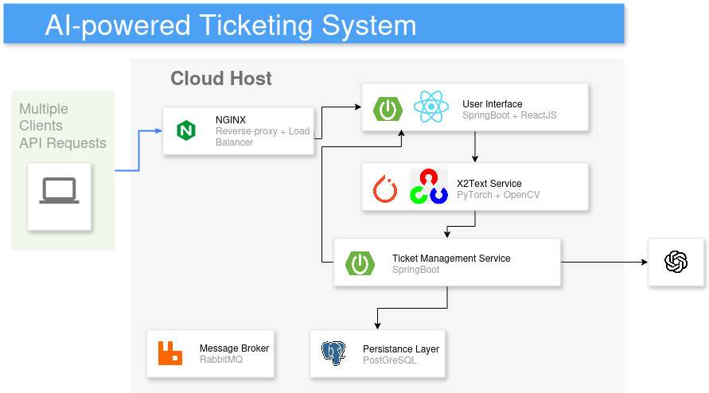

# AI-powered Ticketing Service
This is project done in the context of the lecture "DevOps: Engineering for Deployment and Operations".
It aims to apply DevOps practices, along with Software Engineering practices in a secure learning environment.

## Project Overview

This project includes:
- **Client**: ReactJS with TypeScript, NodeJs, and reusable UI components.
- **Server**: Spring Boot Java application with RESTful APIs.
- **DevOps**: Dockerized services, CI/CD pipelines, and production-ready deployment configurations.

A more detailed overview of the problem we're trying to solve can be found in the [problem statement](problem_statement.md). For an architectural
overview, refer to the [system description](system_description.md).



## Prerequisites

- Node.js (v22 or later)
- Java JDK 21+
- Gradle
- Docker and Docker Compose
- Git

## Deployment Options

### 1. Local Development (Docker Compose)

To run the entire stack locally:

```bash
docker compose up --build
```

This will start all services (auth, user, ticket, media, genai, client, database, traefik, prometheus, grafana) and their dependencies. See each service's subdirectory for API details and configuration options.

All required env variables for the deployment are in `.env-template`

### 2. AWS Cloud Deployment (Terraform + Ansible)

Infrastructure and automated deployment are managed via Terraform and Ansible:

- **Terraform** provisions AWS EC2 instances and networking (see `terraform/`)
- **Ansible** installs Docker and deploys the application stack (see `ansible/`)

To deploy:

```bash
cd terraform
terraform init
export $(grep -v '^#' .env | xargs)
terraform apply
```

This will automatically trigger the Ansible playbook to install Docker and start the containers on the created EC2 instance.

### 3. Kubernetes Cluster (Helm)

For production or scalable deployments, use the Helm chart in `helm/spoved-app/`:

```bash
helm upgrade spoved-app ./helm/spoved-app -n spoved-2 --install
```

Configure values in `helm/spoved-app/values.yaml` as needed for your environment. See the Helm README for details on working with Minikube, Rancher, or other clusters.

## Further Information

- **Service APIs & configuration:** See each microservice's subdirectory (`auth/`, `user/`, `ticket/`, `media/`, `genai/`, `client/`)
- **Infrastructure:** See `terraform/` and `ansible/`
- **Monitoring & Observability:** See `grafana/provisioning/README.md` and `docs/monitoring.md`
- **System Architecture & Design:** See `docs/system_description.md` and diagrams in `resources/`
- **CI/CD & Security:** See `docs/ci-cd.md`

For troubleshooting, usage examples, and advanced configuration, refer to the documentation in the relevant subdirectories.

## License

This project is licensed under the MIT License.