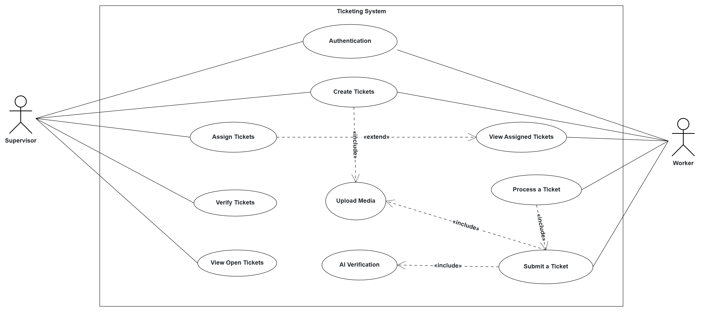

# System Overview to Architecture

## Technical Solution

The system can be divided in the following working modules:

1. Client - Fontend 
2. Auth - Backend
3. User - Backend
4. Media - Backend
5.Ticket - Backend
6. GenAI - AI Backend
7. Database

### 1. Client

This service is responsible for taking in user input. It allows user authentication base on two roles: Supervisor and Worker. If the user is a Worker, than he can create tickets automatically by uploading media with the issue or see the tickets that he was assigned to in order to solve them. If the user is a Supervisor, he can create tickets manually, view all the issued ticked adn assign Workers to solve them.

**Features:**
- Voice input
- Image input
- Ticket submission + status dashboard
- Authentication
- Ticket overview 
- Feedback loops
- Dockerization and deployed with K8s

**Tech Stack:** React, NodeJS, Typescript

### 2. Auth 

The authentication service enables the login of the user. This microservice is used for authentication

**Features**
- CRUD OPERATION
- Persistence  Layer through PostgreSQL
- Dockerization and deployed with K8s

**Teech Stack:** Spring Boot, JWT authentication

### 3. User

It handles the functionalities regarding the user except authentication. 

**Features:**
- CRUD for users (OpenAPI)
- Persistence  Layer through PostgreSQL
- Dockerization and deployed with K8s

**Tech stack**: Spring Boot

### 4. Media

It handles all the functionalities regarding the media. Media service is used to correlate a ticket with the analysis received from the Visual Language Model or Large Language Model. 

**Features:**
- CRUD for media (OpenAPI)
- Persistence  Layer through PostgreSQL
- Dockerization and deployed with K8s

**Tech stack**: Spring Boot

### 5. Ticket

It handles all the functionalities regarding the tickets. The tickets can be created automatically, it by uploading different types of media, or manually by the supervisor. 

**Features:**
- CRUD for tickets (OpenAPI)
- Tracks ticket status (Open, In Progress, Finished)
- Persistence  Layer through PostgreSQL
- Dockerization and deployed with K8s

**Tech stack**: Spring Boot

### 6. GenAI Service

Receives the following inputs: video, photo, audio. For the video, it fragments it in multiple frames and sends all the frames to the VLM along with a textual description. The voice feature is a realtime system that allows the user to converse with an LLM. When the conversation is closed, the system analysis the conversation and it creates a ticket based on the response.

**Feature:**
- Voice-To-Voice conversation
- Video/Photo Anlysis

**Tech Stack:** Python, Gemini, Google Cloud Speech-to-Text, OpneCV

### 7. Database
 
It includes all the tables for the project.

**Tables:**
- ticket
- user
- media
- video_photo (for storing received the analysis)

**Tech Stack:** PostgresSQL

## Infrastructure

1. CI/CD through Github Actions
2. Docker
3. Kubernetes
4. Traefik
5. Monitoring with Grafana + Prometheus
6. Ansible

## System Modelling
To better understand how the entities and service interactions are going to look like, we first derived an **Use Case Diagram**, with 8 common user flows. This diagram can be found below.

### Use Case Diagram

### Class Diagram
From this, we identified the entities required for persisting the data generated during the user flows. We see *User*, *Ticket*, *VideoPhoto* and *Media*.

### Component Diagram
Lastly, we specified the interfaces of the services required to fulfill the functional requirements identified in the user case diagram.

