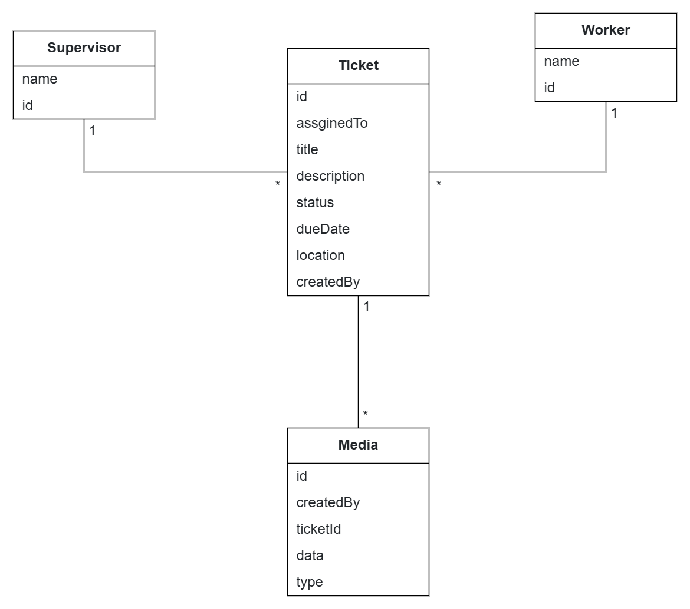

# System Overview —> Architecture

## Technical Solution

The system can be divided in 4 working modules:
1. Client
2. Server
3. GenAI
4. Database

### 1. Client

This service is responsible for taking in user input as either voice or images and will forward it to the relevant conversion service. It provides the frontend of the project.

**Features:**
- Voice input
- Image input
- Ticket submission + status dashboard
- Authentication

**Tech Stack:** React, NodeJS, Typescript

### 2. Server

**Features:**
- CRUD for tickets (OpenAPI)
- Tracks ticket status (Open, In Progress, Resolved)
- Persistence  Layer through PostgreSQL

All of these services will be dockerized and deployed with Kubernetes. Local development will be done with ``Docker Compose``

**Tech stack**: Spring Boot

### 3. GenAI Service

Receives any text/caption input, process the input, analyze it and structures it into an output for a ticket.

**Feature:**
- Turning the voice description into a ticket
- Media analysis for completed tickets

**Tech Stack:** Python, LangChain, OpenAI API, Google Cloud Speech-to-Text

### 4. Database
 
It includes all the tables for the project.

**Tech Stack:** PostgresSQL

## Infrastructure

1. CI/CD through Github Actions
2. Monitoring with Grafana + Prometheus

### Use Case Diagram

### Class Diagram

